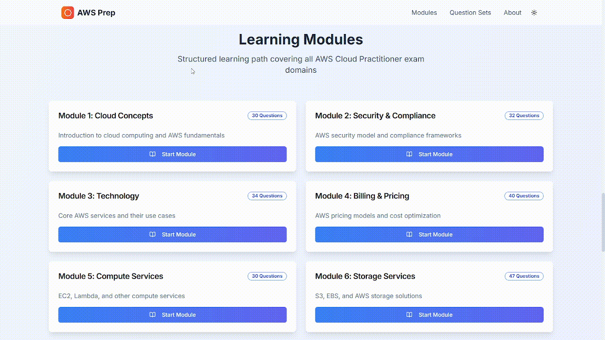
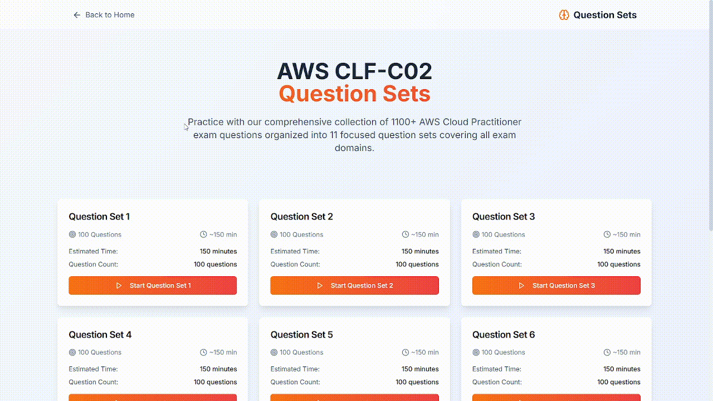
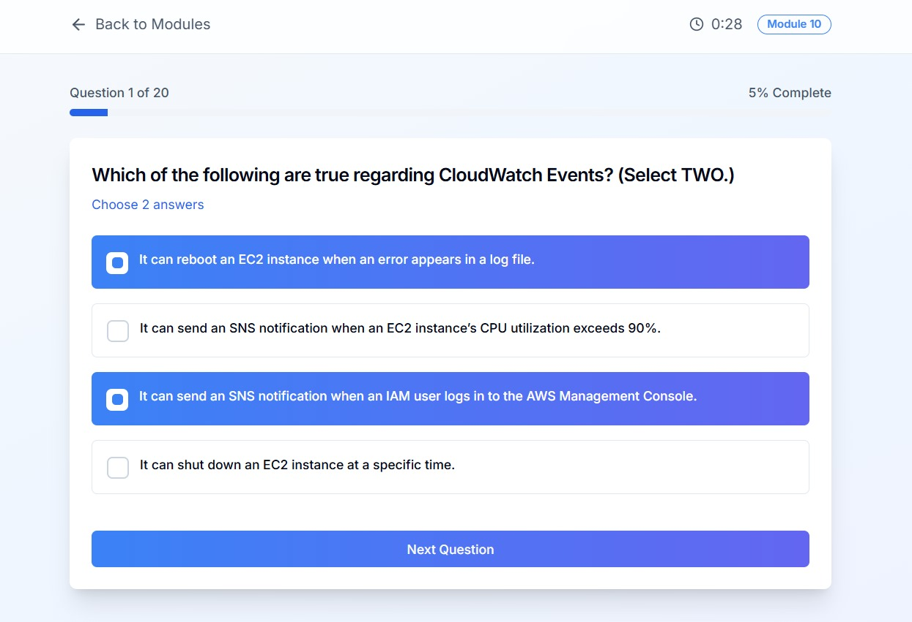

# AWS Cloud Practitioner Exam Prep - CLF-C02

## Project Description
This is a comprehensive preparation platform designed to help users master the AWS Cloud Practitioner (CLF-C02) certification exam. It offers a structured learning path with 10 modules and extensive practice opportunities through 11 question sets, totaling over 1100 practice questions. The platform aims to provide a realistic exam experience with performance analytics and progress tracking.

## Features

*   **Comprehensive Content**: 10 structured learning modules covering all AWS Cloud Practitioner exam domains.
*   **Extensive Practice**: Over 1100 practice questions distributed across 11 dedicated question sets.
*   **Interactive Quizzes**: Engage with questions, select answers, and receive immediate feedback.
*   **Exam Simulation**: Experience a real exam environment to build confidence.
*   **Performance Analytics**: Track your progress and identify areas for improvement.
*   **Mobile Responsive**: Optimized for seamless use across various devices.
*   **Detailed Review**: After completing quizzes, review questions, your answers, and the correct solutions.

## Preview


### Home Page


### Modules Overview


### Question Set


### Exam Simulation


## Tech Stack

This application is built using a modern web development stack to ensure a robust, scalable, and user-friendly experience:

*   **Framework**: Next.js (App Router)
*   **Language**: TypeScript
*   **Styling**: Tailwind CSS
*   **UI Components**: shadcn/ui
*   **Icons**: Lucide React
*   **Form Management**: React Hook Form with Zod for validation
*   **Date Pickers**: React Day Picker
*   **Carousels**: Embla Carousel React
*   **Charts**: Recharts
*   **Notifications**: Custom shadcn/ui toast system

## Getting Started

Follow these steps to set up and run the project locally:

### Prerequisites

*   **Node.js**: Ensure you have Node.js (version 18 or higher) installed. You can download it from [nodejs.org](https://nodejs.org/).
*   **npm / Yarn**: Node.js installation usually includes npm. If you prefer Yarn, you can install it globally: `npm install -g yarn`.
*   **Git**: For cloning the repository.

### Installation

1.  **Clone the repository:**
    First, clone the project repository to your local machine using Git:
    ```bash
    git clone <your-repository-url>
    cd aws-cloud-practitioner-prep
    ```
    Replace `<your-repository-url>` with the actual URL of your GitHub repository.

2.  **Install dependencies:**
    Navigate into the cloned project directory and install the necessary npm packages:
    ```bash
    npm install
    # or if you use Yarn
    yarn install
    ```

3.  **Environment Variables (Optional for current features):**
    This project currently uses local JSON files for quiz data and does not strictly require environment variables for its core functionality. However, if you plan to extend it with external services (e.g., databases, APIs), you would typically create a `.env.local` file in the root directory:
    ```
    # Example environment variable
    NEXT_PUBLIC_API_KEY=your_api_key_here
    ```
    Remember to never commit your `.env.local` file to version control.

### Running the Development Server

To start the development server and view the application:

```bash
npm run dev
# or if you use Yarn
yarn dev
```

The application will be accessible at [http://localhost:3000](http://localhost:3000) in your web browser.

### Building for Production

To build the application for production deployment:

```bash
npm run build
# or if you use Yarn
yarn build
```

This will create an optimized build of your application in the `.next` directory.

## Usage

*   **Home Page**: Provides an overview of the platform, key statistics, and links to modules and question sets.
*   **Learning Modules**: Navigate to `/modules` to explore structured learning content. Each module has a dedicated quiz.
*   **Question Sets**: Navigate to `/question-sets` to access full practice exams.
*   **Quiz Experience**: Select answers, get immediate feedback (in question sets), and review your performance upon completion.

## Contributing

Contributions are welcome! If you have suggestions for improvements or new features, please feel free to open an issue or submit a pull request.

## License

This project is licensed under the MIT License.

## Support

This platform was created by Somashekhar Arabali. If you find this content helpful and would like to support the project, you can [Buy Me A Coffee](https://buymeacoffee.com/omie9284n).